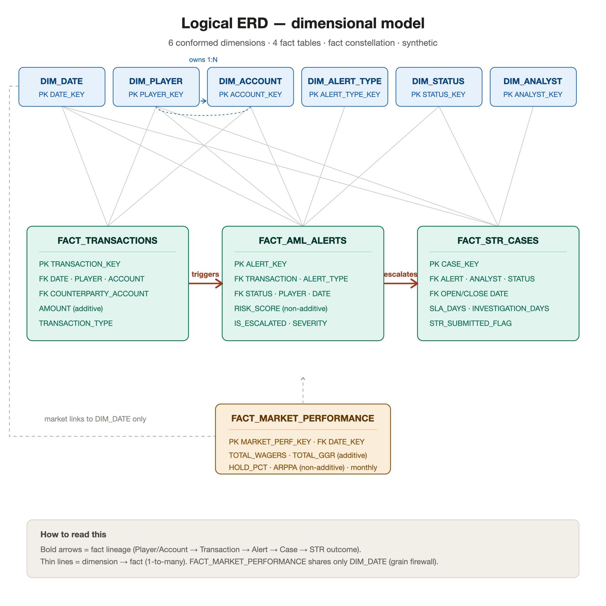

# Gaming Compliance & Risk Intelligence Platform — Snowflake Edition

> A production-style **Snowflake cloud data warehouse** implementation of a regulated
> online-gaming compliance & risk analytics platform: AML transaction monitoring,
> rule-based suspicious-transaction detection, player/account risk analytics, an STR case
> workflow with SLA tracking, market/GGR reporting, governance, and Power BI integration.

> ⚠️ **Synthetic data only.** Every dataset in this project is **fabricated and
> illustrative**. It contains no real people, players, customers, transactions, or market
> figures, and no credentials, secrets, or production information. This is an independent
> **portfolio project** — not affiliated with, endorsed by, or representative of any
> regulator, gaming authority, or operator.

---

## ⚡ Review this project in 5 minutes

1. **What & why** — the [Overview](#overview) and [Business Problem](#business-problem) below.
2. **Why Snowflake** — the [Why Snowflake](#why-snowflake) section.
3. **How it's built** — the [Solution Architecture](#solution-architecture-high-level) layers
   and the [Repository Layout](#repository-layout).
4. **How it's delivered** — the [Phased Implementation](#phased-implementation) roadmap (15 phases).
5. **Docs** — the [Documentation Index](docs/README.md).

**TL;DR:** an enterprise-style, layered Snowflake build (RAW → STAGING → CORE → REPORTING →
BI) of a compliance analytics platform, delivered one validated phase at a time, on
synthetic data.

---

## Overview

This project shows how a **compliance and risk intelligence platform** for a regulated
online-gaming operator could be deployed in a **modern cloud data warehouse (Snowflake)**.
It preserves the business idea of the original build and re-implements it in a cleaner,
phased, enterprise style — layered schemas, dimensional modeling, RBAC governance, data
quality, and BI-ready reporting views.

It is designed to demonstrate, end to end:

1. Snowflake solution architecture
2. Dimensional data modeling
3. AML alert-generation logic
4. STR case workflow analytics
5. Market / GGR reporting
6. Governance and access control
7. Data quality validation
8. Power BI integration
9. Clear technical documentation
10. Professional portfolio presentation

---

## Business Problem

In a regulated online-gaming market, licensed operators must run anti-money-laundering
(AML) programs and file **Suspicious Transaction Reports (STRs)** with their
financial-intelligence regulator (in Canada, **FINTRAC**) when they have reasonable grounds
to suspect money laundering or terrorist financing. At the volumes a real operator
processes, manual review does not scale. Compliance teams need a structured analytics layer
that:

- monitors transactions for suspicious patterns,
- prioritizes alerts by risk,
- manages investigations to regulatory timelines (SLAs), and
- gives leadership visibility into both market performance and compliance health.

This platform models that analytics layer on a cloud data warehouse.

---

## Why Snowflake

A compliance analytics workload benefits directly from Snowflake's design:

- **Separation of storage and compute** — size compute to the job (ingestion vs transform vs
  reporting) and pay only when it runs.
- **Cost control** — virtual warehouses with `AUTO_SUSPEND` / `AUTO_RESUME`; this project
  targets `XSMALL`/`SMALL` warehouses suitable for a portfolio/demo.
- **Governance & auditability** — role-based access control (RBAC), data classification,
  masking and row-access policies, and query history — a natural fit for regulated data.
- **Time Travel & zero-copy cloning** — reproducibility and point-in-time review, valuable
  for audit and historical risk reconstruction.
- **Snowpark** — in-database Python for risk scoring / feature engineering without moving data.
- **Ecosystem** — a first-class **Power BI** connector for the reporting layer.

---

## Solution Architecture (high level)

A layered warehouse, from raw files to the BI/app layer:

```text
Synthetic data files
  ↓
Snowflake stages
  ↓
RAW schema          (source-faithful landing)
  ↓
STAGING schema      (typed, cleaned, standardized)
  ↓
CORE / ANALYTICS    (dimensional model + AML/STR logic)
  ↓
REPORTING schema    (BI-ready views)
  ↓
Power BI / Streamlit / analytics users
```

Database and schema layout:

```text
GAMING_COMPLIANCE_DB
  RAW · STAGING · CORE · ANALYTICS · REPORTING · GOVERNANCE · UTILITY
```

Cost-aware virtual warehouses (defined in Phase 4):
`WH_INGESTION` · `WH_TRANSFORM` · `WH_REPORTING` · `WH_DATA_SCIENCE`.

> Full detail — layer explanation, data flow, warehouse & environment strategy, cost notes,
> and the architecture diagram — is in [`docs/solution_architecture.md`](docs/solution_architecture.md)
> (diagram source: [`diagrams/architecture/solution_architecture.mmd`](diagrams/architecture/solution_architecture.mmd)).

---

## Data Model Overview

A **fact-constellation (galaxy) schema** — 6 conformed dimensions and 4 fact tables. The core
lineage is `Player / Account → Transaction → AML Alert → Investigation Case → STR Outcome`;
`FACT_MARKET_PERFORMANCE` sits beside it at a monthly grain, sharing only `DIM_DATE` (a grain
firewall so market/GGR is never blended with transaction-level AML metrics).



Full detail — every dimension & fact (grain, keys, measures, additivity, SCD strategy), the
physical column-level ERD, and the **SCD Type 2 roadmap** for player/account risk and KYC
history — is in [`docs/data_model.md`](docs/data_model.md) and [`docs/erd.md`](docs/erd.md).

---

## Repository Layout

```text
gaming-compliance-risk-platform/
  README.md · LICENSE · .gitignore
  data/            raw / processed / reference synthetic data (+ disclaimer)
  snowflake/       all SQL, delivered in ordered layers:
    00_setup/        warehouses, database, schemas, roles, grants
    01_ingestion/    file formats, stages, RAW tables, COPY INTO examples
    02_staging/      typed/cleaned staging tables + transformations
    03_core_model/   dimensions + facts (create & load)
    04_aml_rules/    alert-type seed, AML alert generation, scoring
    05_str_workflow/ STR case generation + SLA logic
    06_reporting/    BI-ready reporting views
    07_data_quality/ data-quality + reconciliation + phase-validation checks
    08_automation/   Streams & Tasks (optional)
    09_snowpark/     Snowpark Python example (optional)
    10_powerbi/      Power BI connection guide, model, measures
  docs/            architecture, data model, ERD, AML/STR, governance, validation, limitations
  diagrams/        architecture / data_model / workflow diagrams (.mmd + .png)
  notebooks/       optional exploratory notebooks
  powerbi/         Power BI dashboard specification
```

A full [Documentation Index](docs/README.md) lists every planned document and the phase
that produces it.

---

## Phased Implementation

This project is built **one phase at a time**. Each phase is completed, validated,
documented, and **approved before the next begins** — mirroring a real enterprise delivery
with quality gates. Each phase reports: files created, validation checks, assumptions,
risks/limitations, and what the next phase does.

| # | Phase | Status |
|---|---|---|
| 1 | Project foundation & repository setup | ✅ Complete |
| 2 | Snowflake solution architecture | ✅ Complete |
| 3 | Data model & ERD | ✅ Complete |
| 4 | Snowflake setup scripts (warehouses, DB, schemas, roles) | ✅ Complete |
| 5 | Ingestion layer (file formats, stages, RAW, COPY INTO) | ✅ Complete |
| 6 | Staging layer (typed/cleaned) | ✅ Complete |
| 7 | Core dimensional model (dims + facts) | ✅ Complete |
| 8 | AML rules engine (alert generation + scoring) | ✅ Complete |
| 9 | STR case workflow (cases + SLA) | ⬜ Planned |
| 10 | Reporting views | ⬜ Planned |
| 11 | Data quality & reconciliation | ⬜ Planned |
| 12 | Governance & security | ⬜ Planned |
| 13 | Automation & Snowpark examples | ⬜ Planned |
| 14 | Power BI integration package | ⬜ Planned |
| 15 | Final documentation & portfolio polish | ⬜ Planned |

---

## Portfolio Positioning

This is a **portfolio-grade** demonstration of cloud data-warehouse and compliance-analytics
skills — dimensional modeling, Snowflake platform engineering, AML/STR domain logic,
governance, data quality, and BI enablement — delivered with professional, phased
documentation. It is intentionally **portfolio-safe**: synthetic data, conservative compute
settings, and no secrets. It is a design-and-implementation reference, not a production
system (see `docs/portfolio_limitations.md`, produced in a later phase).

---

## Data Disclaimer

All data is **synthetic, fabricated, and illustrative** and is generated for demonstration
only. It represents no real individuals, players, customers, transactions, accounts, or
market figures. The project contains **no credentials, API keys, secrets, or production
information**, and requests none. See [`data/README.md`](data/README.md).

---

## How to Run

Snowflake scripts are added phase by phase and are designed to run **in numbered order**
(`snowflake/00_setup` → `10_powerbi`) in a Snowflake account of your own. Full setup and
deployment steps are documented in `docs/deployment_guide.md` (produced in a later phase).
No script requires real credentials; you supply your own Snowflake account context.

---

## License

Code and documentation: **MIT License** (see [`LICENSE`](LICENSE)). All data is synthetic and
generated by this repository.
