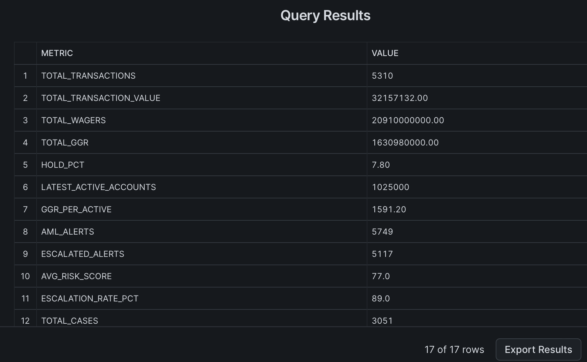
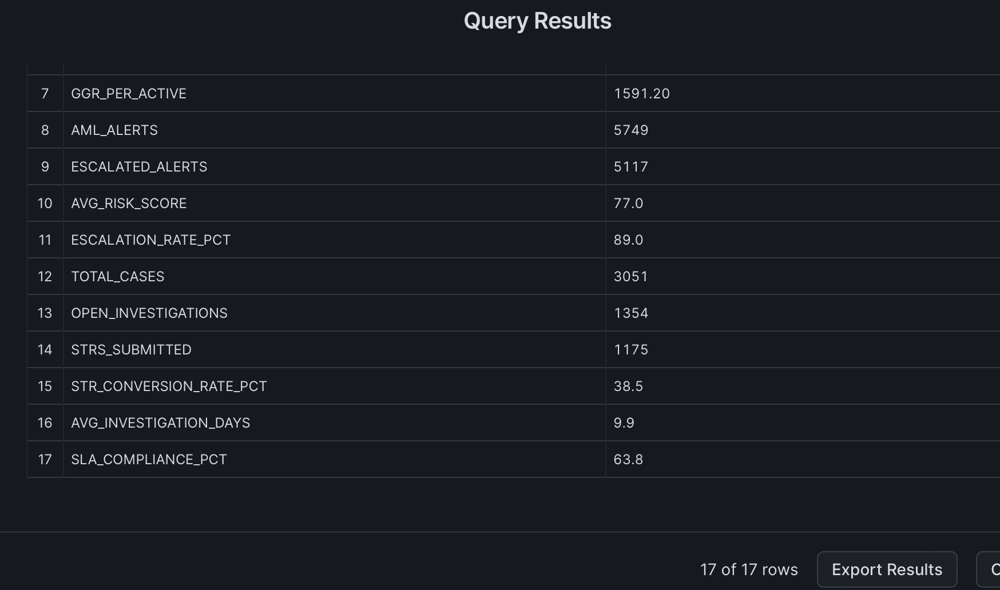
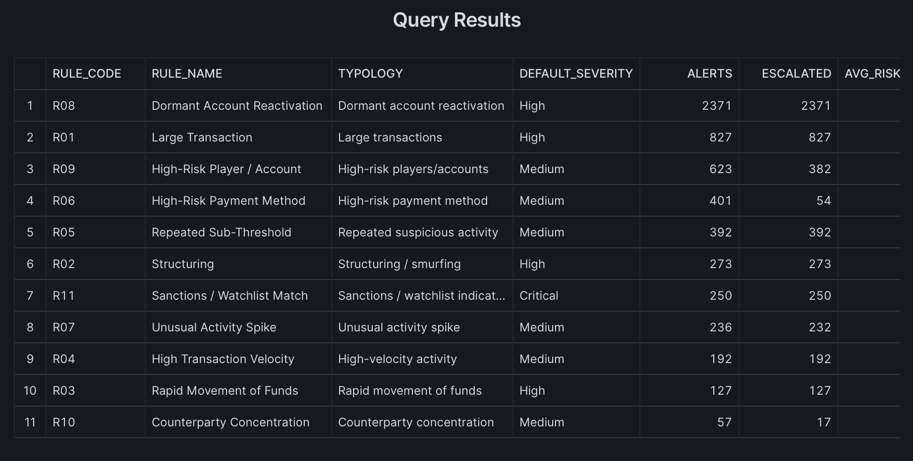
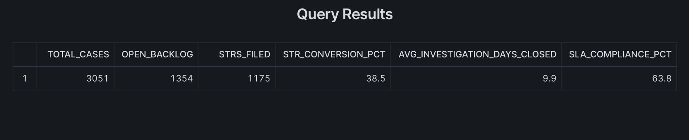
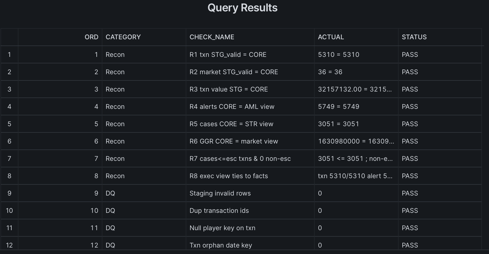
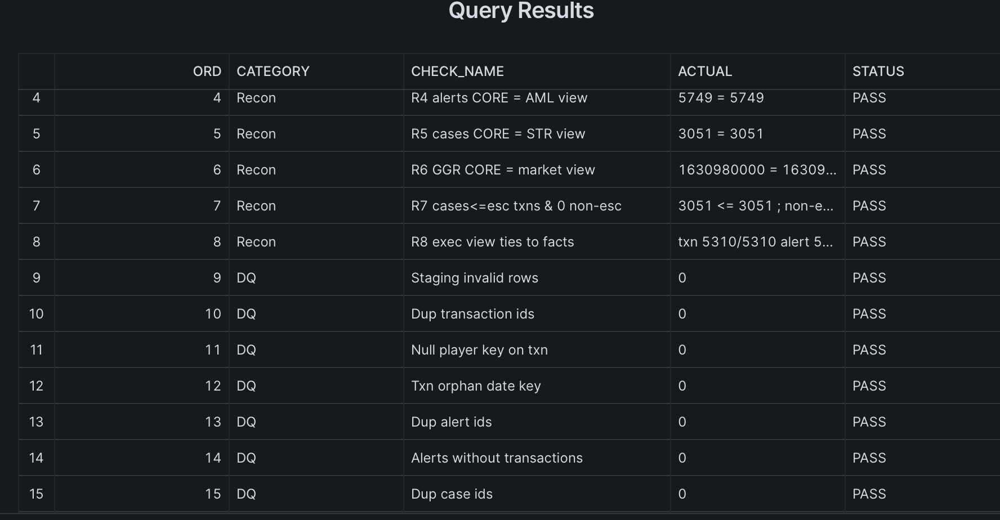

# Gaming Compliance & Risk Intelligence Platform — Snowflake Edition

> A **Snowflake cloud data warehouse** implementation of a regulated
> online-gaming compliance & risk analytics platform: AML transaction monitoring,
> rule-based suspicious-transaction detection, player/account risk analytics, an STR case
> workflow with SLA tracking, market/GGR reporting, governance, and Power BI integration.

> **Synthetic data only.** Every dataset in this project is **fabricated and
> illustrative**. It contains no real people, players, customers, transactions, or market
> figures, and no credentials, secrets, or production information. This is an independent
> **portfolio project** — not affiliated with, endorsed by, or representative of any
> regulator, gaming authority, or operator.

---

## Review this project in 5 minutes

1. **What & why** — the [Overview](#overview) and [Business Problem](#business-problem) below.
2. **Why Snowflake** — the [Why Snowflake](#why-snowflake) section.
3. **How it's built** — the [Solution Architecture](#solution-architecture-high-level) layers
   and the [Repository Layout](#repository-layout).
4. **How it's delivered** — the [Phased Implementation](#phased-implementation) roadmap (15 phases).
5. **Docs** — the [Documentation Index](docs/README.md).

**TL;DR:** a layered Snowflake build (RAW → STAGING → CORE → REPORTING → BI) of a compliance
analytics platform, delivered one validated phase at a time, on synthetic data.

---

## Overview

This project shows how a **compliance and risk intelligence platform** for a regulated
online-gaming operator can be deployed on a **modern cloud data warehouse (Snowflake)**. It is
built with layered schemas, dimensional modeling, RBAC governance, data quality, and BI-ready
reporting views, delivered one validated phase at a time.

It is designed to demonstrate, end to end:

1. Snowflake solution architecture
2. Dimensional data modeling
3. AML alert-generation logic
4. STR case workflow analytics
5. Market / GGR reporting
6. Governance and access control
7. Data quality validation
8. Power BI integration
9. Clear technical documentation
10. Professional portfolio presentation

---

## Business Problem

In a regulated online-gaming market, licensed operators must run anti-money-laundering
(AML) programs and file **Suspicious Transaction Reports (STRs)** with their
financial-intelligence regulator (in Canada, **FINTRAC**) when they have reasonable grounds
to suspect money laundering or terrorist financing. At the volumes a real operator
processes, manual review does not scale. Compliance teams need a structured analytics layer
that:

- monitors transactions for suspicious patterns,
- prioritizes alerts by risk,
- manages investigations to regulatory timelines (SLAs), and
- gives leadership visibility into both market performance and compliance health.

This platform models that analytics layer on a cloud data warehouse.

---

## Why Snowflake

A compliance analytics workload benefits directly from Snowflake's design:

- **Separation of storage and compute** — size compute to the job (ingestion vs transform vs
  reporting) and pay only when it runs.
- **Cost control** — virtual warehouses with `AUTO_SUSPEND` / `AUTO_RESUME`; this project
  targets `XSMALL`/`SMALL` warehouses suitable for a portfolio/demo.
- **Governance & auditability** — role-based access control (RBAC), data classification,
  masking and row-access policies, and query history — a natural fit for regulated data.
- **Time Travel & zero-copy cloning** — reproducibility and point-in-time review, valuable
  for audit and historical risk reconstruction.
- **Snowpark** — in-database Python for risk scoring / feature engineering without moving data.
- **Ecosystem** — a first-class **Power BI** connector for the reporting layer.

---

## Solution Architecture (high level)

A layered warehouse, from raw files to the BI/app layer:

```text
Synthetic data files
  ↓
Snowflake stages
  ↓
RAW schema          (source-faithful landing)
  ↓
STAGING schema      (typed, cleaned, standardized)
  ↓
CORE / ANALYTICS    (dimensional model + AML/STR logic)
  ↓
REPORTING schema    (BI-ready views)
  ↓
Power BI / Streamlit / analytics users
```

Database and schema layout:

```text
GAMING_COMPLIANCE_DB
  RAW · STAGING · CORE · ANALYTICS · REPORTING · GOVERNANCE · UTILITY
```

Cost-aware virtual warehouses (defined in Phase 4):
`WH_INGESTION` · `WH_TRANSFORM` · `WH_REPORTING` · `WH_DATA_SCIENCE`.

> Full detail — layer explanation, data flow, warehouse & environment strategy, cost notes,
> and the architecture diagram — is in [`docs/solution_architecture.md`](docs/solution_architecture.md)
> (diagram source: [`diagrams/architecture/solution_architecture.mmd`](diagrams/architecture/solution_architecture.mmd)).

---

## Data Model Overview

A **fact-constellation (galaxy) schema** — 6 conformed dimensions and 4 fact tables. The core
lineage is `Player / Account → Transaction → AML Alert → Investigation Case → STR Outcome`;
`FACT_MARKET_PERFORMANCE` sits beside it at a monthly grain, sharing only `DIM_DATE` (a grain
firewall so market/GGR is never blended with transaction-level AML metrics).


Full detail — every dimension & fact (grain, keys, measures, additivity, SCD strategy), the
physical column-level ERD, and the **SCD Type 2 roadmap** for player/account risk and KYC
history — is in [`docs/data_model.md`](docs/data_model.md) and [`docs/erd.md`](docs/erd.md).

---

## Repository Layout

```text
gaming-compliance-risk-platform/
  README.md · LICENSE · .gitignore
  data/            raw / processed / reference synthetic data (+ disclaimer)
  snowflake/       all SQL, delivered in ordered layers:
    00_setup/        warehouses, database, schemas, roles, grants
    01_ingestion/    file formats, stages, RAW tables, COPY INTO + synthetic data generator
    02_staging/      typed/cleaned staging tables + transformations
    03_core_model/   dimensions + facts (create & load)
    04_aml_rules/    alert-type seed, AML alert generation, scoring
    05_str_workflow/ STR case generation + SLA logic
    06_reporting/    BI-ready reporting views
    07_data_quality/ data-quality + reconciliation + phase-validation checks
    08_automation/   Streams & Tasks (optional)
    09_snowpark/     Snowpark Python example (optional)
    10_powerbi/      Power BI connection guide, model, measures
  docs/            architecture, data model, ERD, AML/STR, governance, validation,
                   deployment guide, limitations
  diagrams/        architecture / data_model / workflow diagrams (.mmd + .png)
  notebooks/       optional exploratory notebooks
  powerbi/         Power BI dashboard specification
```

A full [Documentation Index](docs/README.md) lists every planned document and the phase
that produces it.

---

## Phased Implementation

This project is built **one phase at a time**. Each phase is completed, validated,
documented, and **approved before the next begins** — a staged delivery with quality gates at
each step. Each phase reports: files created, validation checks, assumptions,
risks/limitations, and what the next phase does.

| # | Phase | Status |
|---|---|---|
| 1 | Project foundation & repository setup | Complete |
| 2 | Snowflake solution architecture | Complete |
| 3 | Data model & ERD | Complete |
| 4 | Snowflake setup scripts (warehouses, DB, schemas, roles) | Complete |
| 5 | Ingestion layer (file formats, stages, RAW, COPY INTO) | Complete |
| 6 | Staging layer (typed/cleaned) | Complete |
| 7 | Core dimensional model (dims + facts) | Complete |
| 8 | AML rules engine (alert generation + scoring) | Complete |
| 9 | STR case workflow (cases + SLA) | Complete |
| 10 | Reporting views | Complete |
| 11 | Data quality & reconciliation | Complete |
| 12 | Governance & security | Complete |
| 13 | Automation & Snowpark examples | Complete |
| 14 | Power BI integration package | Complete |
| 15 | Final documentation & portfolio polish | Complete |

> **Built, executed, and validated.** All 15 phases are complete, and the platform has been
> **run in a Snowflake trial (2026-07-02) and validated — 18/18 setup verification and
> 21/21 reconciliation/DQ**, with all 11 AML typologies firing and every layer reconciling
> ([details](#validation-and-execution-status)). Build it yourself with the
> [Deployment Guide](docs/deployment_guide.md) — the in-database synthetic data generator means
> no files to upload. Scope and caveats: [Portfolio Limitations](docs/portfolio_limitations.md).

---

## Validation and Execution Status

**Executed and validated in Snowflake on 2026-07-02.** The full pipeline — setup →
ingestion + in-database synthetic data → staging → core model → AML rules → STR workflow →
reporting views — built successfully and passed **18/18 setup verification + 21/21
reconciliation/DQ** (all counts and values reconcile end-to-end). Final data: 5,310 transactions,
**5,749 alerts** (all 11 typologies), 3,051 STR cases, 36 market months. Two defects found during
execution (R10 concentration, R03 duplicate alerts) were fixed and re-verified. Full results:
[`docs/validation_results.md`](docs/validation_results.md).

**Status: `Executed & validated — 18/18 + 21/21`.**

Remaining polish (not a blocker): capture evidence screenshots.

| Resource | Purpose |
|---|---|
| [`docs/validation_results.md`](docs/validation_results.md) | The recorded 18/18 verification results (2026-07-02) |
| [`docs/pre_flight_dry_run_review.md`](docs/pre_flight_dry_run_review.md) | Static review that predicted the R10 fix confirmed live |
| [`docs/manual_snowflake_test_plan.md`](docs/manual_snowflake_test_plan.md) | Ordered run + smoke-test queries |
| [`docs/execution_proof_checklist.md`](docs/execution_proof_checklist.md) | Tick-box proof of what ran |
| [`docs/next_real_world_step.md`](docs/next_real_world_step.md) | Remaining steps (evidence, then Cursor later) |

## Execution Evidence

**Executed & validated in Snowflake on 2026-07-02** — 18/18 setup verification + 21/21
reconciliation/DQ (full results in [`docs/validation_results.md`](docs/validation_results.md)).
Screenshots from the live run (synthetic data):

**Executive KPI snapshot** — 5,310 transactions · 5,749 AML alerts · 3,051 STR cases · GGR 1.63B ·
hold 7.8% (the one-row view shown transposed so all 17 KPIs are legible):




**AML alerts by typology** — all **11** rules firing (R10 counterparty concentration = 57 after
the fix); the `ALERTS` column sums to 5,749:



**STR workflow summary** — 3,051 cases, 1,175 STRs filed, 38.5% conversion, 63.8% SLA compliance:



**Reconciliation & data quality — 21/21 PASS** — R1–R8 tie end-to-end (`5749 = 5749`,
`3051 = 3051`, value/GGR reconcile) and duplicate alert IDs = 0 after the R03 fix (rows 1–15
shown; the full 21-row grid is recorded in [`docs/validation_results.md`](docs/validation_results.md)):




---

## Portfolio Positioning

This is a **portfolio-grade** demonstration of cloud data-warehouse and compliance-analytics
skills — dimensional modeling, Snowflake platform engineering, AML/STR domain logic,
governance, data quality, and BI enablement — delivered with professional, phased
documentation. It is intentionally **portfolio-safe**: synthetic data, conservative compute
settings, and no secrets. It is a design-and-implementation reference, not a production
system (see [`docs/portfolio_limitations.md`](docs/portfolio_limitations.md)).

## Portfolio Scope and Limitations

**What this project demonstrates**

- A layered **Snowflake implementation** (RAW → STAGING → CORE → REPORTING → BI) built as a
  **cloud data warehouse simulation** on synthetic data.
- Dimensional modeling, explainable AML rule logic, an STR workflow with SLAs, a **Power
  BI-ready semantic layer**, governance demo patterns, and a data-quality/validation framework.

**What it does *not* claim to be**

- Not `production-ready`, `regulator-ready`, `enterprise-grade`, or `fully validated`.
- Governance is an **illustrative demo pattern**, not a hardened access-control design.
- All data is **synthetic**; there is no real customer/player data and no regulatory-system
  integration.
- The scripts are **prepared for manual Snowflake execution** and have **not** been run/tested
  live from this environment — see [Validation and Execution Status](#validation-and-execution-status).

In short: a **synthetic compliance-analytics platform** and Snowflake implementation pattern,
honest about the gap between a portfolio build and a production system.

---

## Snowflake Skills Demonstrated

This project is being built as a **hands-on Snowflake implementation** — a way to develop
practical, applied Snowflake skills while producing a portfolio piece. Each skill maps to a
real deliverable in the repo (not just generated code):

- **Platform:** layered database & schemas, cost-aware virtual warehouses (`AUTO_SUSPEND`),
  least-privilege RBAC roles & grants
- **Ingestion:** reusable file formats, internal stages, `COPY INTO` with load metadata,
  `TRANSIENT` RAW landing
- **Transformation:** typed STAGING with `TRY_TO_*` casts, category normalization, and
  data-quality flags
- **Modeling:** dimensional fact-constellation, 6 dimensions + 4 facts, surrogate keys,
  deliberate grain management
- **Analytics SQL:** 11 AML rule typologies, STR/SLA logic, CTEs, window functions
  (`LAG`, `PERCENTILE_CONT`, `QUALIFY`), `CASE` logic, aggregations
- **Serving:** Power BI-ready reporting views (business-named semantic layer), reconciliation
  & validation checks
- **Governance:** data classification tags, `MP_IDENTIFIER` masking & `RAP_REGION` row-access
  policies, extended Time Travel on restricted facts
- **Automation & data science:** append-only Streams and a stream-gated (suspended) Task;
  a Snowpark Python risk-scoring example (connection by name/env — no hard-coded credentials)
- **BI enablement:** Power BI connection guide, recommended semantic model, DAX measures, and a
  page-level dashboard specification

**Learning + validation docs:**
[Learning audit](docs/snowflake_learning_audit.md) ·
[Skills matrix](docs/snowflake_skills_matrix.md) ·
[Phases 1–9 audit](docs/current_state_phase_01_to_09_audit.md) ·
[Reporting layer](docs/reporting_layer.md) ·
[Phase 10 learning notes](docs/phase_10_reporting_views_learning_notes.md) ·
[Pre-Phase-10 checklist](docs/pre_phase10_validation_checklist.md) ·
[Post-Phase-10 results](docs/post_phase10_validation_results.md)

---

## Data Disclaimer

All data is **synthetic, fabricated, and illustrative** and is generated for demonstration
only. It represents no real individuals, players, customers, transactions, accounts, or
market figures. The project contains **no credentials, API keys, secrets, or production
information**, and requests none. See [`data/README.md`](data/README.md).

---

## How to Run

Scripts run **in numbered order** (`snowflake/00_setup` → `10_powerbi`) in a Snowflake account
of your own — a [free trial](https://signup.snowflake.com/) is enough. The in-database
generator ([`01_ingestion/05_generate_synthetic_data.sql`](snowflake/01_ingestion/05_generate_synthetic_data.sql))
populates the RAW tables with synthetic data, so **no files need to be uploaded**. Full
step-by-step setup, verification, cost, and teardown steps are in the
**[Deployment Guide](docs/deployment_guide.md)**. No script requires real credentials; you
supply your own Snowflake account context.

---

## License

Code and documentation: **MIT License** (see [`LICENSE`](LICENSE)). All data is synthetic and
generated by this repository.
