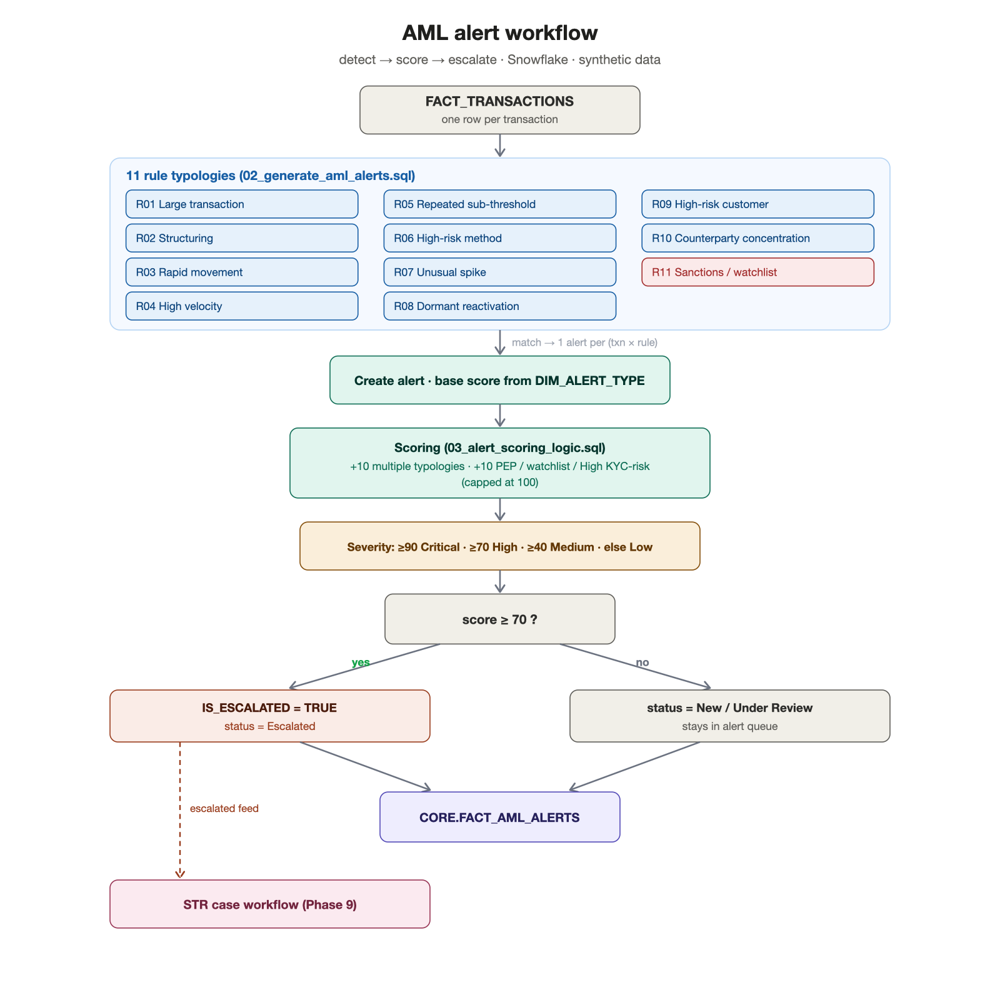

# AML Rules Framework

> **Phase 8 deliverable.** The 11 rule-based AML typologies, how alerts are generated, and
> how they are scored and escalated. Implemented in `snowflake/04_aml_rules/`. All data is
> **synthetic**; thresholds and regulatory references are illustrative.

---

## 1. Design principles

- **Explainable, rule-based detection.** Every alert traces to a named rule with a clear
  threshold — an investigator (and a regulator) can see *why* it fired. Thresholds live in the
  SQL `WHERE`/`HAVING` clauses.
- **One alert per (transaction × rule).** A transaction that trips multiple rules produces
  multiple alert rows (grain of `FACT_AML_ALERTS`), and gets a multi-typology score boost.
- **Transparent scoring.** A base score per rule + small, additive modifiers → final score →
  severity band → escalation. No black box.

## 2. The 11 rule typologies

| Rule | Typology | Logic (threshold) | Base | Severity |
|---|---|---|---|---|
| **R01** | Large transactions | single transaction ≥ 10,000 | 70 | High |
| **R02** | Structuring / smurfing | ≥ 3 transactions in 9,000–9,999 per account | 80 | High |
| **R03** | Rapid movement of funds | deposit → ≥90% withdrawal, same account, within 6h | 75 | High |
| **R04** | High-velocity activity | ≥ 8 transactions on one account in a day | 60 | Medium |
| **R05** | Repeated suspicious activity | ≥ 5 sub-threshold (<10,000) transactions/account/day | 60 | Medium |
| **R06** | High-risk payment method | Crypto / Prepaid Card ≥ 5,000 | 55 | Medium |
| **R07** | Unusual activity spike | daily account total ≥ 5× the account median (and ≥ 5,000) | 65 | Medium |
| **R08** | Dormant account reactivation | 30+ day gap, then a transaction ≥ 5,000 | 70 | High |
| **R09** | High-risk players/accounts | ≥ 3,000 by a High KYC-risk player or High-risk account | 55 | Medium |
| **R10** | Counterparty concentration | ≥ 4 transactions totalling ≥ 20,000 to the same counterparty | 65 | Medium |
| **R11** | Sanctions / watchlist match | any transaction by a watchlisted player (**mandatory**) | 95 | Critical |

Seeded in `01_alert_type_seed_data.sql` (`CORE.DIM_ALERT_TYPE`); detected in
`02_generate_aml_alerts.sql`.

## 3. Scoring, severity & escalation (`03_alert_scoring_logic.sql`)

Each alert starts at its rule's **base score**, then gains transparent modifiers:

```text
final_score = BASE_RISK_SCORE
            + 10   if the same transaction triggered MULTIPLE typologies
            + 10   if the player is PEP / watchlisted / High KYC-risk
            (capped at 100)
```

- **Severity bands:** `≥90 Critical · ≥70 High · ≥40 Medium · else Low`.
- **Escalation:** `IS_ESCALATED = (final_score ≥ 70)`. Escalated alerts move to status
  **Escalated** and become the input to the **STR case workflow (Phase 9)**.
- **Multiple typology triggers** are handled two ways: separate alert rows *and* the +10
  boost, so a transaction caught by several rules rises in priority.

## 4. What every alert contains (`CORE.FACT_AML_ALERTS`)

`ALERT_ID`, `TRANSACTION_KEY`/id, `PLAYER_KEY`, `ACCOUNT_KEY`, `ALERT_TYPE_KEY` (type),
`ALERT_DESCRIPTION`, `SEVERITY`, `RISK_SCORE`, `ALERT_TIMESTAMP` + `DATE_KEY`, `IS_ESCALATED`,
and `STATUS_KEY` (current status) — satisfying the required alert fields, all joined back to
the transaction that raised it.

## 5. Alert workflow



*Source: [`../diagrams/workflows/aml_alert_workflow.mmd`](../diagrams/workflows/aml_alert_workflow.mmd).*

## 6. Limitations (portfolio-safe)

- Thresholds are illustrative and tuned for **synthetic** data; a real programme calibrates
  them to its own risk appetite and false-positive tolerance.
- Some time windows (7-day structuring, 30-day concentration) are simplified to per-account
  or per-day scopes in SQL for clarity.
- R11 uses the player-level `WATCHLIST_FLAG` (derived from sanctioned activity) as the
  screening signal; a real system screens each party against live sanctions lists.
- Detection is purely rule-based here; a production build would add tuned ML and ongoing
  threshold calibration (noted in Future Enhancements).
