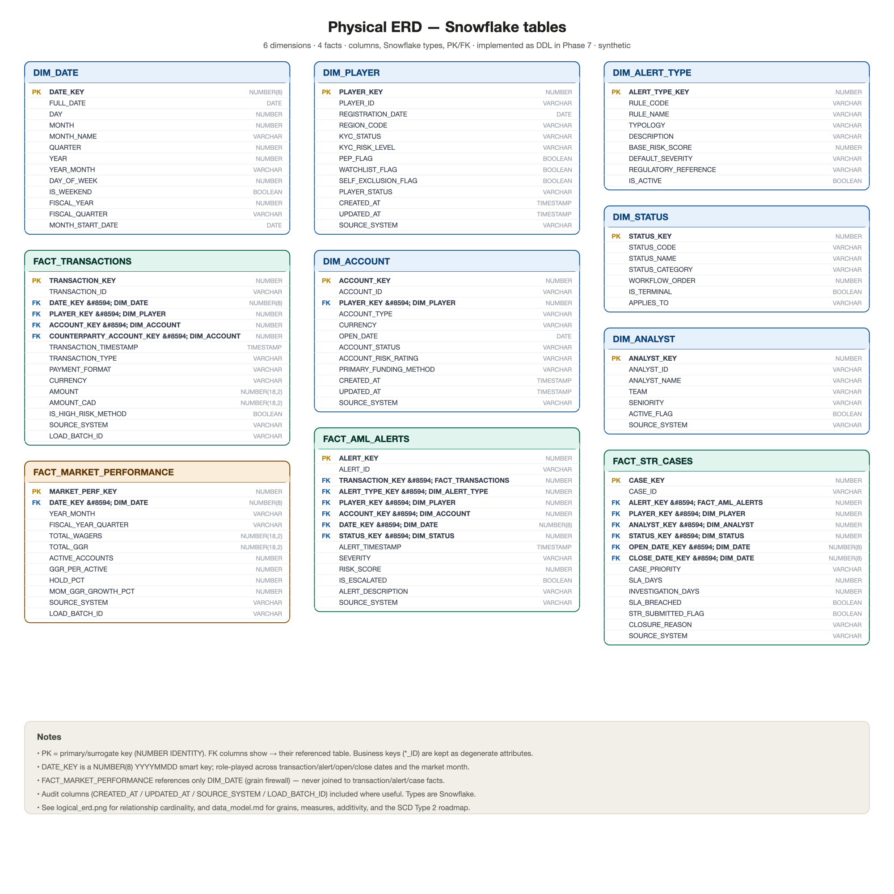

# Entity-Relationship Diagram (ERD)

> **Phase 3 deliverable.** Logical and physical ERDs for the dimensional model. The full
> attribute/measure/SCD detail is in [`data_model.md`](data_model.md); this file focuses on
> the entities, relationships, and diagrams.

## Rendering these diagrams

Each ERD has a **canonical Mermaid source** (`.mmd`, the editable/portable version) and a
**rendered `.png`** alongside it in [`../diagrams/data_model/`](../diagrams/data_model).

- Render with Mermaid CLI: `mmdc -i logical_erd.mmd -o logical_erd.png`
- Or paste the `.mmd` into <https://mermaid.live>.
- The committed PNGs were produced in this environment via an SVG fallback (no Mermaid CLI
  installed here); the `.mmd` remains the source of truth.

---

## Logical ERD

Business entities, their relationships, and marquee attributes.


Source: [`logical_erd.mmd`](../diagrams/data_model/logical_erd.mmd)

## Physical ERD

Full column-level design with Snowflake data types and PK/FK markers (implemented as DDL in
Phase 7).



Source: [`physical_erd.mmd`](../diagrams/data_model/physical_erd.mmd)

---

## Relationships & cardinality

| Parent (PK side) | Child (FK side) | Cardinality | Meaning |
|---|---|---|---|
| `DIM_PLAYER` | `DIM_ACCOUNT` | 1‑to‑many | a player owns one or more accounts |
| `DIM_PLAYER` | `FACT_TRANSACTIONS`, `FACT_AML_ALERTS`, `FACT_STR_CASES` | 1‑to‑many | the subject of activity |
| `DIM_ACCOUNT` | `FACT_TRANSACTIONS` (×2: originating + counterparty) | 1‑to‑many | role-playing account |
| `DIM_DATE` | all four facts | 1‑to‑many | role-playing calendar (txn / alert / open / close / month) |
| `DIM_ALERT_TYPE` | `FACT_AML_ALERTS` | 1‑to‑many | rule/typology that fired |
| `DIM_STATUS` | `FACT_AML_ALERTS`, `FACT_STR_CASES` | 1‑to‑many | workflow status |
| `DIM_ANALYST` | `FACT_STR_CASES` | 1‑to‑many | assigned investigator |
| `FACT_TRANSACTIONS` | `FACT_AML_ALERTS` | 1‑to‑many | a transaction can raise several alerts |
| `FACT_AML_ALERTS` | `FACT_STR_CASES` | 1‑to‑many | an escalated alert becomes a case |
| `DIM_DATE` | `FACT_MARKET_PERFORMANCE` | 1‑to‑many | **only** shared dimension (grain firewall) |

## The lineage (the spine of the model)

```text
Player / Account → Transaction → AML Alert → Investigation Case → STR Outcome
```

`FACT_MARKET_PERFORMANCE` is deliberately **outside** this chain: it is a monthly market fact
sharing only `DIM_DATE`, so market/GGR metrics are never blended with transaction-grain AML
metrics.

## Notes

- **Surrogate keys** (`*_KEY`) join facts to dimensions; **business keys** (`*_ID`) are kept
  as degenerate attributes for traceability.
- **Role-playing dimensions** (`DIM_DATE`, `DIM_ACCOUNT`) are handled in Power BI via
  multiple/inactive relationships and `USERELATIONSHIP`.
- The physical model uses Snowflake types (`NUMBER`, `VARCHAR`, `DATE`, `TIMESTAMP_NTZ`,
  `BOOLEAN`) and adds audit columns; see [`data_model.md`](data_model.md).
