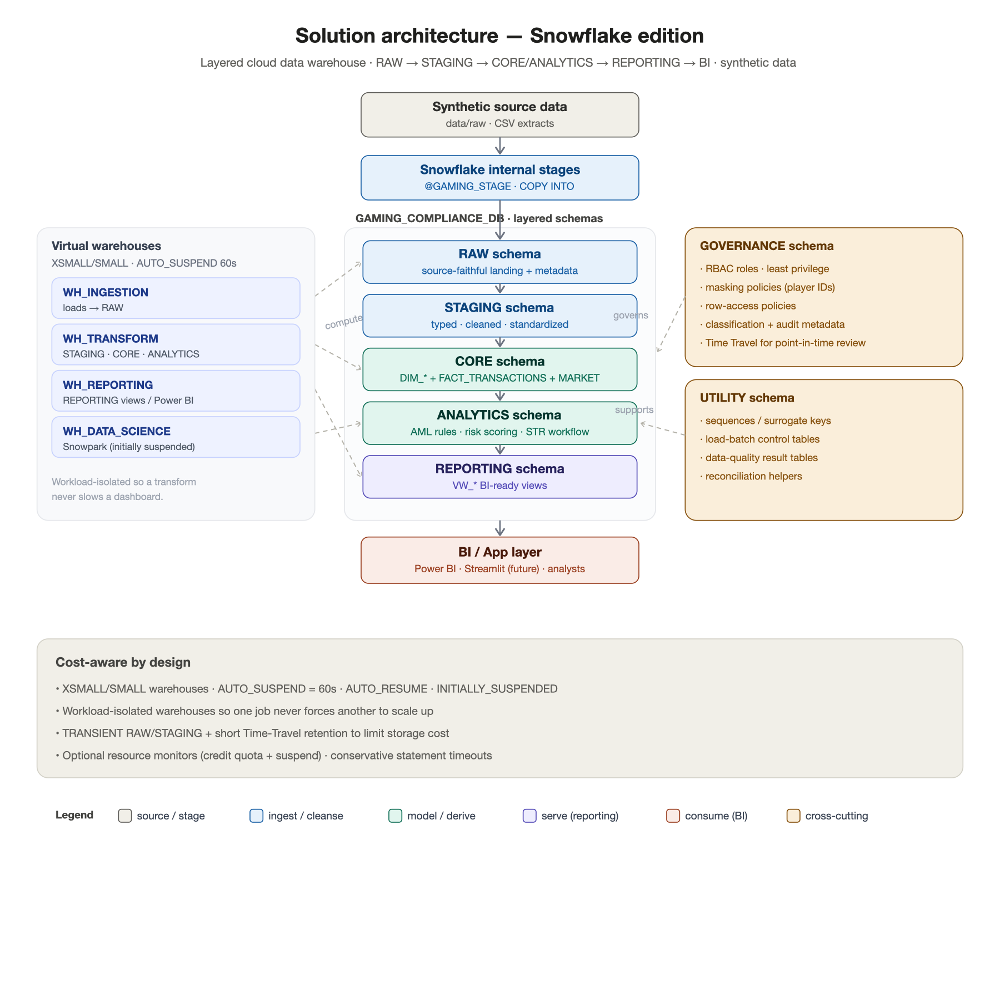

# Solution Architecture — Snowflake Edition

> **Phase 2 deliverable.** How the Gaming Compliance & Risk Intelligence Platform is deployed
> on Snowflake: the layered schema architecture, end-to-end data flow, virtual-warehouse
> strategy, environment strategy, and cost-awareness. All data is **synthetic**.

---

## 1. Architecture at a glance



*Canonical editable source: [`solution_architecture.mmd`](../diagrams/architecture/solution_architecture.mmd)
(render with `mmdc` or [mermaid.live](https://mermaid.live)). The PNG was rendered in this
environment via an SVG fallback (no Mermaid CLI installed here).*

The platform follows a **layered ("medallion-style") warehouse** pattern — data moves
strictly one direction, from source files to the BI/app layer, gaining structure and trust
at each step:

```text
Synthetic data files
  ↓
Snowflake stages
  ↓
RAW schema          source-faithful landing
  ↓
STAGING schema      typed · cleaned · standardized
  ↓
CORE / ANALYTICS    dimensional model + AML/STR logic
  ↓
REPORTING schema    BI-ready views
  ↓
Power BI / Streamlit / analytics users
```

---

## 2. Database & schema layout

A single database, `GAMING_COMPLIANCE_DB`, with one schema per architectural responsibility.
Separating layers by schema keeps grants, lineage, and lifecycle clean.

| Schema | Layer | Responsibility |
|---|---|---|
| `RAW` | Landing | Source-faithful copies of the loaded files + load metadata (`LOAD_BATCH_ID`, `SOURCE_FILE_NAME`, `LOADED_AT`). No transformation. |
| `STAGING` | Cleanse | Typed, cleaned, standardized data: casts, null handling, category normalization, date validation. Preserves source traceability. |
| `CORE` | Curate | The conformed **dimensional model** — `DIM_*` plus `FACT_TRANSACTIONS` and `FACT_MARKET_PERFORMANCE`. Surrogate keys, audit columns. |
| `ANALYTICS` | Derive | The compliance **engine**: AML rule logic, risk scoring, and the STR workflow — which produce `FACT_AML_ALERTS` and `FACT_STR_CASES`, plus analytical aggregates and Snowpark features. |
| `REPORTING` | Serve | BI-ready **views** (`VW_*`) with business-friendly names and correct grain. The only layer BI tools read. |
| `GOVERNANCE` | Cross-cutting | RBAC objects, masking policies, row-access policies, data classification, and audit helpers. |
| `UTILITY` | Cross-cutting | Sequences / surrogate-key helpers, load-control tables, and data-quality result tables. |

**Grain discipline (important):** transaction-level AML data and monthly market/GGR data have
**different grains** and are kept separate. `FACT_MARKET_PERFORMANCE` is a monthly market
fact joined only to `DIM_DATE`; it is never joined to transaction/alert/case facts. Reporting
views respect this so no metric is double-counted across grains.

---

## 3. Data flow (end to end)

1. **Source** — synthetic files land in `data/raw/` (transaction extracts, monthly
   market/GGR figures, reference/seed data).
2. **Stage** — files are put to a Snowflake **internal stage** and loaded with `COPY INTO`
   using reusable **file formats**. (Phase 5.)
3. **RAW** — one raw table per source, source-shaped, plus load metadata. Nothing is
   discarded here; RAW is the audit-friendly system of landing. (Phase 5.)
4. **STAGING** — RAW is cleaned and typed: correct data types, trimmed/normalized text,
   validated dates, standardized categories, null handling — while keeping columns that trace
   each row back to its source file/batch. (Phase 6.)
5. **CORE** — staging feeds the dimensional model: conformed dimensions and the
   transaction & market facts, with surrogate keys and audit columns. (Phase 7.)
6. **ANALYTICS** — AML rules run over `FACT_TRANSACTIONS` to generate `FACT_AML_ALERTS`
   (typology, severity, risk score, escalation); escalated alerts become `FACT_STR_CASES`
   with SLA logic. (Phases 8–9.)
7. **REPORTING** — curated views expose executive, AML, STR, market, and player-risk metrics
   for consumption. (Phase 10.)
8. **Consume** — Power BI (and, as a future enhancement, a Streamlit-in-Snowflake
   case-review app) and analysts/auditors query **only** the reporting views.

Cross-cutting: **GOVERNANCE** applies RBAC and policies across the database; **UTILITY**
supplies sequences, load-batch control, and stores data-quality results (Phase 11).

---

## 4. Virtual-warehouse strategy

Compute is separated by workload so a heavy transform never slows a dashboard, and each
workload can be sized and suspended independently. All warehouses are **XSMALL/SMALL** with
aggressive auto-suspend — appropriate for a portfolio/demo.

| Warehouse | Powers | Size | Notes |
|---|---|---|---|
| `WH_INGESTION` | Stages + `COPY INTO` into RAW | XSMALL | Bursty; suspends between loads. |
| `WH_TRANSFORM` | STAGING, CORE, ANALYTICS (AML/STR logic) | XSMALL → SMALL | The main ELT workhorse; scale to SMALL only for heavier runs, then back down. |
| `WH_REPORTING` | REPORTING views / Power BI | XSMALL | Read-mostly; multi-cluster is a *future* option if concurrency grows — single-cluster for demo. |
| `WH_DATA_SCIENCE` | Snowpark / notebooks | XSMALL | Created **suspended**; started only for the optional Snowpark work (Phase 13). |

All warehouses use:
- `AUTO_SUSPEND = 60` (seconds) — release compute quickly when idle,
- `AUTO_RESUME = TRUE` — spin up on demand,
- `INITIALLY_SUSPENDED = TRUE` — never bill for idle compute at creation.

Defined in Phase 4 (`snowflake/00_setup/01_create_warehouses.sql`).

---

## 5. Environment strategy

For a portfolio/demo, the project targets a **single Snowflake account** with **schema-based
layer separation** inside `GAMING_COMPLIANCE_DB` (simplest and cheapest). The design scales
to real environments without rework:

- **Dev / test / prod** — promote by deploying the same ordered scripts into separate
  databases (e.g. `GAMING_COMPLIANCE_DEV/TEST/PROD`) or by using **zero-copy clones**
  (`CREATE DATABASE ... CLONE`) to stand up a test copy instantly at no storage cost.
- **Reproducibility** — **Time Travel** allows point-in-time queries and recovery; useful for
  audit and for historical risk reconstruction (which SCD Type 2, see the data model, makes
  first-class).
- **Deployment** — scripts run in numbered order (`00_setup` → `10_powerbi`). CI/CD
  (e.g. schemachange / GitHub Actions) is noted as a **future enhancement**, not built here.
- **Idempotency** — scripts use `CREATE OR REPLACE` / `IF NOT EXISTS` so environments can be
  rebuilt cleanly.

---

## 6. Cost-awareness notes

Deliberate choices to keep this cheap to run and safe to leave idle:

- **Small compute:** XSMALL is the default; SMALL only where a workload clearly benefits.
- **Auto-suspend 60s + auto-resume + initially-suspended:** you pay only while a query runs.
- **Workload isolation:** four purpose-built warehouses prevent one workload from forcing
  another to scale up.
- **Transient tables for RAW/STAGING:** these ephemeral layers can be `TRANSIENT` to avoid
  Fail-safe and reduce Time-Travel storage costs (they are always rebuildable from source).
- **Modest Time-Travel retention:** a short `DATA_RETENTION_TIME_IN_DAYS` (e.g. 1) on
  transient layers keeps storage low.
- **Optional resource monitors:** a credit quota with a suspend action can hard-cap spend
  (documented in Phase 12 / setup).
- **Statement timeouts:** a conservative `STATEMENT_TIMEOUT_IN_SECONDS` guards against
  runaway queries.

---

## 7. Alignment with Snowflake best practices

- **Layered / medallion architecture** with one-directional flow and schema-per-layer.
- **Separation of storage and compute**; workload-isolated, right-sized, auto-suspending
  warehouses.
- **RBAC with least privilege** — functional roles granted on schemas per layer (Phase 4/12),
  no direct end-user access to RAW/CORE.
- **Governance built in** — masking / row-access policies, classification, and audit metadata
  rather than bolted on.
- **Metadata & lineage** — load-batch and audit columns from RAW through CORE.
- **Idempotent, ordered, commented SQL**; uppercase object names; no hardcoded credentials.
- **Reproducibility** via Time Travel and zero-copy cloning.

---

## 8. What Phase 3 does next

Phase 3 produces the **data model & ERD**: every dimension and fact (grain, keys, measures,
SCD strategy), the logical and physical ERDs (Mermaid + PNG), the README "Data Model Overview"
section, and the **SCD Type 2 roadmap** for player risk rating, KYC status, account status,
and account risk rating.
