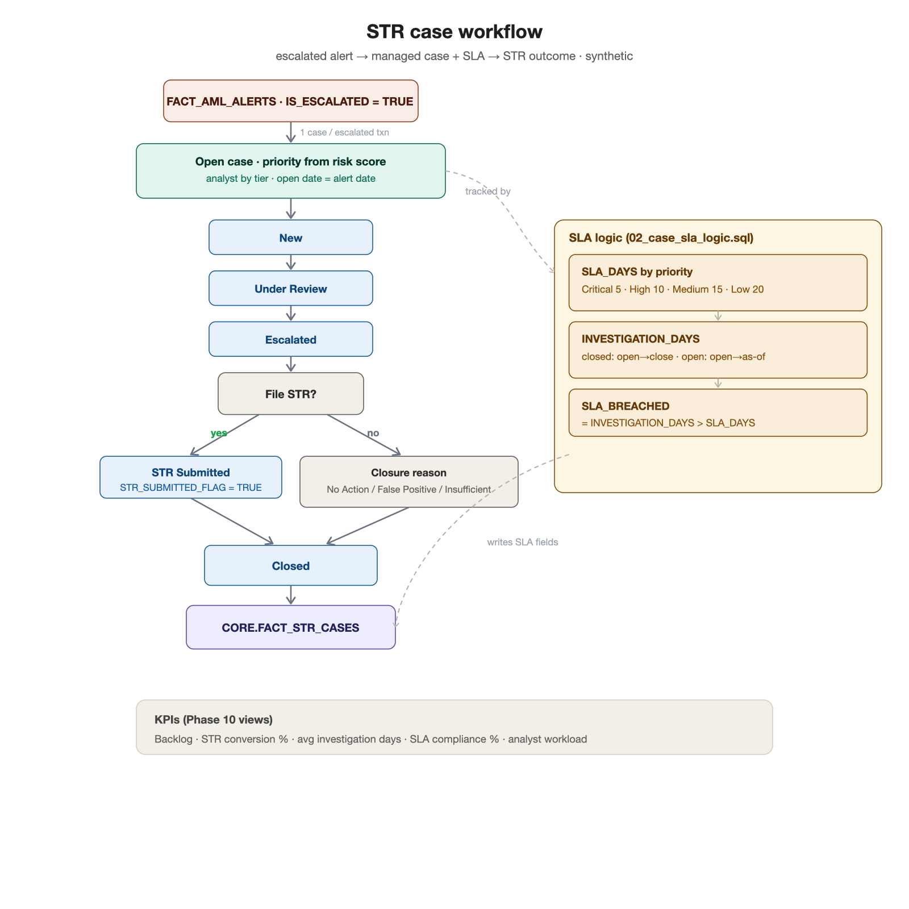

# STR Case Workflow

> **Phase 9 deliverable.** How escalated AML alerts become **Suspicious Transaction Report
> (STR)** investigation cases, move through a managed pipeline with SLAs, and reach an
> outcome. Implemented in `snowflake/05_str_workflow/`. All data is **synthetic**.

---

## 1. What this models

When an AML alert is escalated (Phase 8: `RISK_SCORE ≥ 70`), it becomes a **case** that an
analyst investigates. If suspicion is confirmed, an **STR** is filed. The workflow tracks each
case from open to close, on a deadline (SLA), so leadership can see backlog, throughput, and
compliance with regulatory timelines.

```text
Escalated AML alert → open case → investigate → (file STR?) → close
```

Only **escalated / high-risk** alerts become cases — enforced by
`WHERE IS_ESCALATED = TRUE` in `01_generate_str_cases.sql` (one case per escalated
transaction, using its highest-risk alert).

## 2. The 5-stage pipeline (`CORE.DIM_STATUS`)

| Order | Status | Category | Terminal |
|---|---|---|---|
| 1 | New | Open | no |
| 2 | Under Review | Open | no |
| 3 | Escalated | Open | no |
| 4 | STR Submitted | Open | no |
| 5 | Closed | Closed | **yes** |

`IS_TERMINAL` cleanly separates **open** (work remaining) from **resolved** cases — every KPI
uses it.

## 3. Case generation (`01_generate_str_cases.sql`)

For each escalated alert, the case gets:

- **Priority** from the alert's risk score — `≥90 Critical · ≥80 High · else Medium`.
- **Analyst assignment by tier** — High/Critical cases go to senior/lead investigators
  (AN-003/007/014), Medium to junior AML Ops (AN-001/011); chosen deterministically by hash
  (so the load is spread but reproducible). QA is not assigned live cases.
- **Open date** = the alert date.
- A deterministic **lifecycle** — status, close date (for closed cases), STR-submitted flag
  (higher likelihood for higher priority), and closure reason.

## 4. SLA logic (`02_case_sla_logic.sql`)

- **SLA target by priority:** Critical **5** · High **10** · Medium **15** · Low **20** days.
- **Investigation duration:** closed cases = open→close; open cases = open→a simulation
  "as-of" date (latest known case date + 3 days) so ages are realistic within the synthetic
  window.
- **SLA breach:** `SLA_BREACHED = INVESTIGATION_DAYS > SLA_DAYS`.

## 5. What every case contains (`CORE.FACT_STR_CASES`)

`CASE_ID`, `ALERT_KEY` (→ the triggering alert), `PLAYER_KEY`, `ANALYST_KEY` (assigned
analyst), `STATUS_KEY` (case status), `OPEN_DATE_KEY`, `CLOSE_DATE_KEY` (where applicable),
`CASE_PRIORITY`, `SLA_DAYS` (target), `INVESTIGATION_DAYS`, `SLA_BREACHED`,
`STR_SUBMITTED_FLAG`, `CLOSURE_REASON` — every required case field.

## 6. Program KPIs (computed in `02`, surfaced in Phase 10 views)

Backlog (open cases), **STR conversion %** (STRs filed ÷ cases), average investigation days
(closed), and **SLA compliance %** (closed-on-time ÷ closed) — plus per-analyst workload and a
status funnel.

## 7. Workflow diagram



*Source: [`../diagrams/workflows/str_case_workflow.mmd`](../diagrams/workflows/str_case_workflow.mmd).*

## 8. Limitations (portfolio-safe)

- Case lifecycle, analyst assignment, and outcomes are **synthesized deterministically** for
  demonstration — no real investigations or filings occur.
- A single triggering alert per case is modeled; a real system often consolidates several
  alerts/transactions into one case.
- SLA targets are illustrative; real programmes set them by policy and risk appetite.
